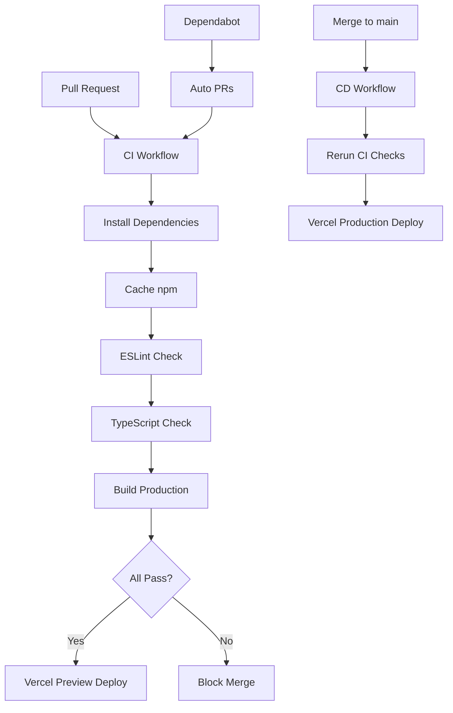

# Plano: Infraestrutura Completa de CI/CD para STL Festival

## Análise do Projeto Atual

**Stack Identificada:**

- Astro 4.0+ (SSG) com React 18 islands
- TypeScript 5+ (config strict)
- TailwindCSS 3.4+
- Framer Motion para animações
- Deploy: Vercel (static site)

**Gap Identificado:**

- Sem ESLint ou Prettier configurados
- Sem scripts de validação (lint, typecheck, format)
- Sem estrutura `.github/`
- Usa variável de ambiente: `CLOUDINARY_VIDEO_URL`

## Estratégia CI/CD



**Princípios:**

1. **Fail Fast**: Validações na ordem: lint → typecheck → build
2. **Workflows Separados**: `ci.yml` (validação) e `cd.yml` (deploy)
3. **Zero Confiança**: Mesmo branch `main` valida antes do deploy
4. **Caching Inteligente**: npm cache para speed
5. **Preview Deploy**: Todo PR gera preview no Vercel

## Estrutura `.github/` a Criar

```
.github/
├── workflows/
│   ├── ci.yml                 # Validação (lint, typecheck, build)
│   └── cd.yml                 # Deploy (Vercel prod/preview)
├── ISSUE_TEMPLATE/
│   ├── bug_report.yml         # Template de bug
│   ├── feature_request.yml    # Template de feature
│   └── chore.yml              # Template de manutenção
├── pull_request_template.md   # Template de PR
└── dependabot.yml             # Auto-updates npm + Actions
```

## Implementação

### 1. Configurações de Qualidade de Código

**Arquivos:** [`eslint.config.js`](eslint.config.js), [`.prettierrc`](.prettierrc), [`.prettierignore`](.prettierignore)

- **ESLint**: Config flat para Astro + React + TypeScript usando `eslint-plugin-astro`, `@typescript-eslint`, e plugins React
- **Prettier**: Integração com Astro plugin, semi: false, singleQuote: true, tabs 2 spaces
- **Scripts no package.json**:
  ```json
  "lint": "eslint . --ext .js,.jsx,.ts,.tsx,.astro --max-warnings 0"
  "format": "prettier --write \"**/*.{js,jsx,ts,tsx,astro,json,md}\""
  "typecheck": "tsc --noEmit"
  ```

### 2. CI Workflow ([`.github/workflows/ci.yml`](.github/workflows/ci.yml))

**Trigger:** Push em qualquer branch, Pull Requests para `main`

**Jobs:**

1.  **validate** (Ubuntu latest, Node 20):

            - Checkout code
            - Setup Node com cache npm
            - `npm ci` (instalação limpa)
            - `npm run lint` (bloqueia se warnings/errors)
            - `npm run typecheck` (valida TS sem emitir)
            - `npm run build` (garante build funcional)

**Características:**

- `--max-warnings 0`: Bloqueia por qualquer warning
- Matrix strategy preparada para testes em múltiplas Node versions (futuro)
- Cache de `~/.npm` para acelerar installs

### 3. CD Workflow ([`.github/workflows/cd.yml`](.github/workflows/cd.yml))

**Trigger:**

- Push para `main` (production deploy)
- Pull Requests (preview deploy)

**Dependência:** Requer CI passar primeiro (`needs: [validate]` ou workflow_run)

**Jobs:**

1.  **deploy-preview** (se PR):

            - Usa `vercel deploy --prebuilt` após `astro build`
            - Comenta URL de preview no PR

2.  **deploy-production** (se main):

            - Usa `vercel deploy --prod --prebuilt`
            - Requer `VERCEL_TOKEN`, `VERCEL_ORG_ID`, `VERCEL_PROJECT_ID` em Secrets

**Secrets GitHub necessários:**

- `VERCEL_TOKEN`: Token de deploy do Vercel
- `VERCEL_ORG_ID`: ID da organização Vercel
- `VERCEL_PROJECT_ID`: ID do projeto Vercel
- `CLOUDINARY_VIDEO_URL`: (opcional, ou configurar no Vercel diretamente)

### 4. Templates de Colaboração

**Pull Request Template** ([`.github/pull_request_template.md`](.github/pull_request_template.md)):

- Checklist: testes, lint, build, screenshots
- Seções: Descrição, Tipo de mudança, Como testar, Impacto
- Conventional Commits reminder

**Issue Templates** ([`.github/ISSUE_TEMPLATE/`](.github/ISSUE_TEMPLATE/)):

- `bug_report.yml`: Ambiente, passos para reproduzir, comportamento esperado/atual, screenshots
- `feature_request.yml`: Problema, solução proposta, alternativas, contexto
- `chore.yml`: Tipo de manutenção, descrição, impacto

### 5. Dependabot ([`.github/dependabot.yml`](.github/dependabot.yml))

**Configuração:**

- **npm**: Updates semanais, máximo 5 PRs abertos, prefixo `chore(deps):`, agrupamento por tipo
- **GitHub Actions**: Updates semanais, prefixo `chore(ci):`
- Reviewers sugeridos (ajustar para seu time)
- Labels automáticos: `dependencies`, `ci`

### 6. Environment Variables ([`.env.example`](.env.example))

Criar arquivo de exemplo com:

```bash
# Cloudinary Video CDN
CLOUDINARY_VIDEO_URL=https://res.cloudinary.com/...

# Vercel (apenas para CI/CD, não commitar)
# VERCEL_TOKEN=
# VERCEL_ORG_ID=
# VERCEL_PROJECT_ID=
```

### 7. Atualizar package.json

Adicionar devDependencies:

- `eslint` (~8.57.0)
- `@typescript-eslint/parser` + `@typescript-eslint/eslint-plugin`
- `eslint-plugin-astro`
- `eslint-plugin-react` + `eslint-plugin-react-hooks`
- `eslint-plugin-jsx-a11y` (acessibilidade)
- `prettier` (~3.x)
- `prettier-plugin-astro`
- `eslint-config-prettier` (desabilita regras conflitantes)

Adicionar scripts mencionados anteriormente.

## Branch Protection Rules (Configuração Manual GitHub)

**Settings → Branches → Add rule** para `main`:

1.  **Require pull request reviews**

            - At least 1 approval (ajustar conforme time)
            - Dismiss stale reviews when new commits pushed

2.  **Require status checks to pass**

            - Require branches to be up to date
            - Status checks: `validate` (do CI workflow)

3.  **Require conversation resolution before merging**

4.  **Do not allow bypassing the above settings**

            - Inclui administrators (recomendado)

5.  **Require linear history** (opcional, force rebases)

## Conventional Commits (Padronização)

**Formato obrigatório:** `type(scope): subject`

**Types:**

- `feat`: Nova feature
- `fix`: Correção de bug
- `docs`: Documentação
- `style`: Formatação (não afeta código)
- `refactor`: Refatoração sem mudar comportamento
- `perf`: Melhoria de performance
- `test`: Adição de testes
- `chore`: Manutenção (deps, config)
- `ci`: Mudanças em CI/CD

**Exemplos:**

```
feat(hero): add video autoplay on scroll
fix(preloader): correct mobile detection logic
chore(deps): update framer-motion to 11.1.0
ci: add typecheck step to CI workflow
```

## Checklist de Produção

### Antes de Deploy Inicial

- [ ] Criar projeto no Vercel e conectar ao repo GitHub
- [ ] Configurar **Environment Variables** no Vercel: - `CLOUDINARY_VIDEO_URL` (ou outras necessárias)
- [ ] Obter e adicionar **GitHub Secrets**: - `VERCEL_TOKEN`: Gerar em Vercel → Settings → Tokens - `VERCEL_ORG_ID`: Rodar `vercel --token=$TOKEN` localmente - `VERCEL_PROJECT_ID`: Rodar `vercel --token=$TOKEN` localmente
- [ ] Instalar dependências: `npm install` (adiciona ESLint, Prettier)
- [ ] Rodar localmente: `npm run lint`, `npm run typecheck`, `npm run build`
- [ ] Corrigir todos os erros/warnings encontrados
- [ ] Commit inicial: `chore: setup ci/cd infrastructure`

### Configuração GitHub

- [ ] Adicionar **Branch Protection Rules** em `main` (ver seção acima)
- [ ] Configurar **CODEOWNERS** (opcional):

  ```

  ```

* @seu-usuario-github
  /src/components/ @frontend-lead
  /.github/ @devops-lead

```

- [ ] Testar PR flow:

      1. Criar branch `test/ci-setup`
      2. Fazer pequena mudança
      3. Abrir PR para `main`
      4. Verificar CI passa + Preview deploy gerado
      5. Merge PR
      6. Verificar Production deploy automático

### Monitoramento Contínuo

- [ ] Habilitar **notifications** do Dependabot
- [ ] Configurar **Slack/Discord webhook** para deploys (Vercel Integrations)
- [ ] Revisar PRs do Dependabot semanalmente
- [ ] Manter `.env.example` atualizado quando adicionar envs

### Segurança

- [ ] **NUNCA** commitar `.env` (já no `.gitignore` do Astro)
- [ ] Revisar secrets expostos: `git log -p | grep -i "token\|secret\|key"`
- [ ] Rotacionar `VERCEL_TOKEN` a cada 90 dias
- [ ] Habilitar **2FA** em contas GitHub e Vercel

## Decisões Técnicas Justificadas

1. **Workflows Separados (ci.yml + cd.yml):**

          - Modularidade: CI pode rodar em qualquer branch, CD apenas em contextos específicos
          - Reusabilidade: CI pode ser chamado por outros workflows
          - Clareza: Responsabilidades distintas

2. **ESLint Flat Config (eslint.config.js):**

          - ESLint 9+ deprecou `.eslintrc`, flat config é o futuro
          - Melhor TypeScript IntelliSense
          - Configuração mais explícita e componível

3. **Vercel CLI em Actions (não GitHub integration):**

          - Controle granular sobre o processo de build
          - Permite validações customizadas antes do deploy
          - Possibilita rollback programático

4. **Typecheck separado de build:**

          - Astro build pode passar mesmo com erros TS em alguns casos
          - `tsc --noEmit` garante zero erros de tipagem
          - Fail fast: typecheck é mais rápido que build completo

5. **Dependabot com limits:**

          - `open-pull-requests-limit: 5`: Evita spam de PRs
          - Updates semanais (não daily): Balanceia segurança com overhead de review

## Próximos Passos (Futuro)

- [ ] Adicionar testes unitários (Vitest) e integration tests
- [ ] Lighthouse CI para performance budgets
- [ ] Sentry/Error tracking integration
- [ ] Visual regression testing (Chromatic/Percy)
- [ ] Renovate.bot como alternativa ao Dependabot (mais features)
```
